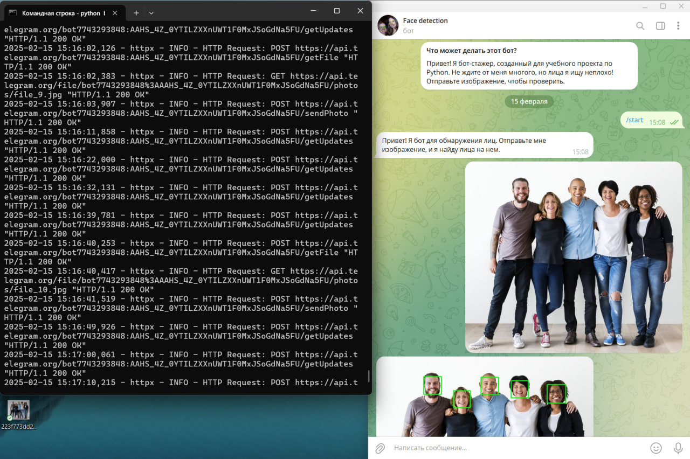

# Микросервис для распознавания лиц (Telegram-бот Face_Detection)

Это Telegram-бот, который обнаруживает лица на изображениях с использованием OpenCV и бэкенд API, построенного на FastAPI. Бот позволяет пользователям отправлять изображения и получать координаты обнаруженных лиц прямо в Telegram.

## Как это работает

Этот микросервис предоставляет два способа взаимодействия: через Telegram-бота и через API.

**1. Использование Telegram-бота:**

   1. Пользователь отправляет изображение Telegram-боту.
   2. Бот пересылает изображение бэкенд API.
   3. Бэкенд API использует OpenCV для обнаружения лиц на изображении.
   4. Бэкенд API сохраняет координаты обнаруженных лиц в базе данных PostgreSQL.
   5. Бот получает координаты обнаруженных лиц и обработанное изображение от бэкенд API.
   6. Бот отправляет сообщение пользователю с координатами обнаруженных лиц и изображением с обведенными лицами.

**2. Использование API напрямую:**

   1. Пользователь отправляет изображение на API-endpoint `http://127.0.0.1:8000/api/detect_faces/`.
   2. Бэкенд API использует OpenCV для обнаружения лиц на изображении.
   3. Бэкенд API сохраняет координаты обнаруженных лиц в базе данных PostgreSQL.
   4. API возвращает JSON-ответ с координатами обнаруженных лиц, сообщением об успехе и изображением с обведенными лицами в формате Base64.


## Конфигурация

*   **Telegram Bot Token:**
    *   Получение НОВОГО токена у [BotFather](https://t.me/BotFather) в Telegram. ИЛИ я его отправила вам в личные сообщения. 
    *   Установите токен в файле `telegram_bot.py`, заменив `" "` на полученный токен.

*   **Настройки базы данных PostgreSQL:**
    *   Измените параметры подключения к базе данных в файле `app/db/database.py` (хост, имя базы данных, пользователь, пароль). ИЛИ я его отправила вам в личные сообщения. 

## Установка

1.  **Клонируйте репозиторий:** 
    ```bash
    git clone Face_detection
    ```
2.  **Создайте виртуальное окружение:** 
    ```bash
    python -m venv venv
    ```

3.  **Активируйте виртуальное окружение:** 

    *   Windows:

        ```bash
        venv\Scripts\activate
        ```

    *   macOS/Linux:

        ```bash
        source venv/bin/activate
        ```

4. **Установите зависимости:**
    ```bash
    pip install -r requirements.txt
    ```

## Зависимости

Основные библиотеки, используемые в проекте:

*   `fastapi`: Для создания API.
*   `uvicorn`: ASGI-сервер для запуска FastAPI.
*   `opencv-python`: Для обработки изображений и обнаружения лиц.
*   `psycopg2`: Для подключения к PostgreSQL.
*   `python-telegram-bot`: Для создания Telegram-бота.


## Запуск

1.  **Запустите PostgreSQL:** Убедитесь, что сервер PostgreSQL запущен и доступен.

2.  **Запустите бэкенд API:**
    ```bash
    uvicorn app.main:app --reload
    ```

3.  **Запустите Telegram-бота:**
    ```bash
    python telegram_bot.py
    ```

## Использование
API будет доступен по адресу `http://127.0.0.1:8000`.

## Команды бота

*   `/start`: Отображает приветственное сообщение и описание бота.
*   Отправьте изображение: Бот обнаружит лица на изображении и вернет изображение с лицами, отмеченными голубыми прямоугольниками с их координатами. Далее сохраняются в базу данных, у меня это: facedetection. 

## Выполненные задачи:

• Создан API с использованием FastAPI.

• Разработка backend-логики для обработки изображений с использованием OpenCV.

• Хранение изображений и результатов в базе данных. PostgreSQL: facedetection. 

• Реализована отправка изображений с обведенными лицами в Telegram-бот.

• Применение паттернов:
- Factory: `FaceDetectorFactory` для создания экземпляров `FaceDetector`;
- Service: `DetectionService` для инкапсуляции бизнес-логики;
- Repository: Реализован в `DetectionService` для взаимодействия с базой данных;

• Применение тестов pytest. Для проверки функции - правильно ли обрабатывает изображение и возвращает с отмеченными лицами.

• Валидация:
- Проверка типа файла, отправленного пользователем. Бот должен принимать только изображения.

• Шаблоны HTML и реализация API (HTML и скрипт): использован Jinja2.

## Структура проекта


## Далее скрины для наглядности проекта и его реализации




